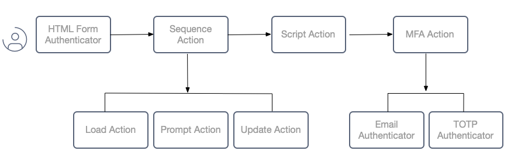

# Authentication Actions Toolbox

An example custom authentication workflow that uses actions to operate on user attributes.

## Custom Authentication Workflow

The following example workflow is used, which involves both custom data and custom logic:



## Deploy the System

Get a license for the Curity Identity Server and copy it into the root folder.\
Also ensure that Docker is installed, then deploy the system with the following command:

```bash
./deploy.sh
```

Next login to the Admin UI at `https://localhost:6749/admin` with credentials `admin / Password1`.\
Navigate to the authentication service to view the configuration of authenticators and authentication actions.

## Documentation

See the [Authentication Actions Toolbox](https://curity.io/resources/learn/authentication-actions-toolbox/) tutorial for further details.\
This includes instructions on running an end-to-end setup on your local computer.

## Further Information

Please visit [curity.io](https://curity.io/) for more information about the Curity Identity Server.